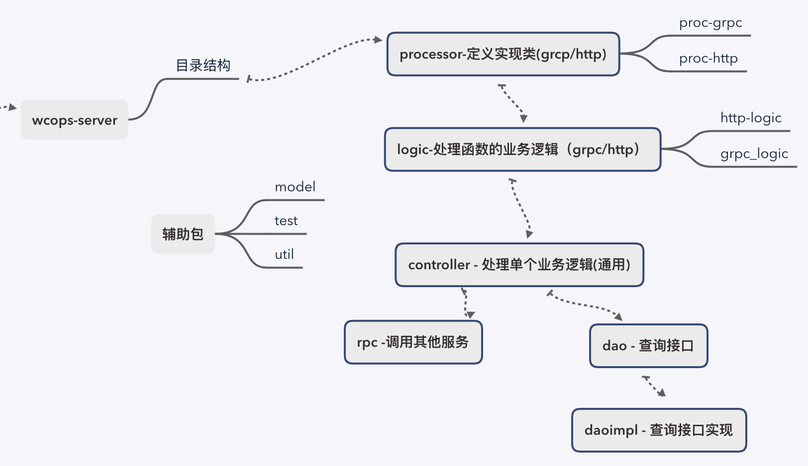

# go-practice-demo
学习Go过程中，总结记录的一下demo合计

***
### 工程目录结构



### 交叉编译
``` ~~~~~~~~
 CGO_ENABLED=0 GOOS=linux GOARCH=amd64 go build  hello.go

 nohup ./hello >> nohup.log 2>&1 
```


***

### Http请求Url格式
> 整体的api路径起名规范：  xxxapi/{服务分组}/{服务名}/{api 路径} 
```http request
router.POST("//xxxapi/xxx/xxx/commodity/sort", snetutil.HttpRequestJsonBodyWrapper(wechatcourse.FactoryModuleSort))
router.POST("//xxxapi/xxx/xxx/commodity/list/search", snetutil.HttpRequestJsonBodyWrapper(wechatcourse.FactoryGetLearnListSearch))
router.POST("//xxxapi/xxx/xxx/commodity/list", snetutil.HttpRequestJsonBodyWrapper(wechatcourse.FactoryGetCommodityList))
router.POST("//xxxapi/xxx/xxx/commodity/get", snetutil.HttpRequestJsonBodyWrapper(wechatcourse.FactoryGetCommodity))
router.POST("//xxxapi/xxx/xxx/commodity/update", snetutil.HttpRequestJsonBodyWrapper(wechatcourse.FactoryUpdateCommodity))
router.POST("//xxxapi/xxx/xxx/commodity/add", snetutil.HttpRequestJsonBodyWrapper(wechatcourse.FactoryAddCommodity))
router.POST("//xxxapi/xxx/xxx/commodity/delete", snetutil.HttpRequestJsonBodyWrapper(wechatcourse.FactoryDeleteCommodity))
```

*** 
### DAO层方法命名规范
Create/Update/Get/Batch
``` go
    CreateModelBean(ctx context.Context, id int64) error
    CreateModelBean1(ctx context.Context, other int64) (int64, error)
    UpdateModelBean(ctx context.Context, id int64) error
    DeleteModelBean(ctx context.Context, id int64) error

    GetOtherIdsById(ctx context.Context, id int64) ([]int64, error)
    GetModelBean(ctx context.Context, id int64) (*ModelBeanMeta, error)
    GetCountByOtherId(ctx context.Context, otherId int64) (int, error)
    BatchGetModelBean(ctx context.Context, id int64) ([]*ModelBeanMeta, error)
    BatchGetModelBeanByIds(ctx context.Context, ids []int64) ([]*ModelBeanMeta, error)
    PageGetModelBean1(ctx context.Context, id int64) ([]*ModelBeanMeta, error)
```


### GRPC定义方法规范
Add/Set/Del/Get/List
``` 
rpc AddClassStudent(AddClassStudentReq) returns (AddClassStudentRes);
rpc SetUserAuthId(SetUserAuthIdReq) returns (SetUserAuthIdRes);
rpc DelClassStudent(DelClassStudentReq) returns (DelClassStudentRes);
rpc GetClass(GetClassReq) returns(GetClassRes);
rpc GetClassCountByCourseId(GetClassCountByCourseIdReq) returns(GetClassCountByCourseIdRes);
rpc ListClass(ListClassReq) returns(ListClassRes);
rpc ListStudentIdByClassId(ListStudentIdByClassIdReq) returns(ListStudentIdByClassIdRes);
rpc PutPrincipalPolicy
rpc GenerateIAMAppKey
rpc CheckIAMAuth

 
message AddClassStudentReq{
    int64 student_id = 1;
    int64 class_id = 2;
}
message AddClassStudentRes{
   util.grpcutil.ErrInfo errinfo = 1;
   message Data {
       int64 id = 1;
   }
   Data data = 2;
}


message DelClassStudentReq{
    int64 student_id = 1;
    int64 class_id = 2;
}
message DelClassStudentRes{
    util.grpcutil.ErrInfo errinfo = 1;
}


message SetUserAuthIdReq{
    int64 student_id = 1;
    int64 auth_student_id = 2;
}
message SetUserAuthIdRes{
    util.grpcutil.ErrInfo errinfo = 1;
}

 
message GetClassReq {
    int64 id = 1;
}
message GetClassRes {
   util.grpcutil.ErrInfo errinfo = 1;
   ClassData data = 2;
}


message ListClassReq {
    int64 course_id = 1;
    int64 begin_course_start_time = 2;
    int64 end_course_start_time = 3;
    string teacher = 4;
}
message ListClassRes {
    util.grpcutil.ErrInfo errinfo = 1;
    repeated ClassData data = 2;
}
message ClassData {
  string name = 1;
  string teacher = 2;
  int64 course_start_time = 3;
  int64 monitor_uid = 4;
  int64 course_id = 5;
  int64 expected_student_count = 6;
  string monitor_openids = 7;
  string opuser = 8;
  int64 ct = 9;
  int64 ut = 10;
  bool is_delete = 11;
}


message ListStudentIdByClassIdReq {
    int64 class_id = 1;
}
message ListStudentIdByClassIdRes {
   util.grpcutil.ErrInfo errinfo = 1;
   message Data {
      repeated int64 student_id = 1;
   }
   Data data = 2;
}


message GetClassCountByCourseIdReq {
    int64 course_id = 1;
}
message GetClassCountByCourseIdRes {
    util.grpcutil.ErrInfo errinfo = 1;
    message Data {
        int64 num = 1;
    }
    Data data = 2;
}
```

#### 异常处理
> 异常封装，层层上报
> 不建议在controller、dao中直接记录错误日志，可以将要记录的错误内容封装到返回的Error中，统一有最上层方法打印，避免一个错误重复多次！
使用：https://zhenghe-md.github.io/blog/2020/10/05/Go-Error-Handling-Research/